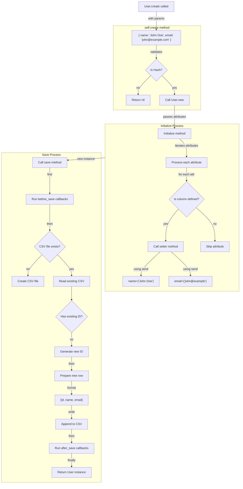

# Building a Mini ORM with Ruby Metaprogramming: A Deep Dive into Active Record Pattern

Object-Relational Mapping (ORM) frameworks like ActiveRecord are fundamental to modern web development, but have you ever wondered how they work under the hood? In this post, I'll walk you through building a minimal ORM using Ruby's powerful metaprogramming features. We'll create a system that handles basic database operations, associations, and even callbacks - all while storing data in CSV files for simplicity.

## The Core Foundation

At the heart of our Mini ORM is the `MiniRecord` class, which serves as the base class for our models. Let's look at how we define our models:

```ruby
class User < MiniRecord
  column :name, String.new
  column :email, String.new
  has_many :posts
  
  before_save :test_before_save
  after_save :test_after_save
  
  def test_before_save
    puts 'before save is working'
  end
  
  def test_after_save
    puts 'after save is working'
  end
end

class Post < MiniRecord
  column :title, String.new
  column :content, String.new
  column :user_id, 0
  belongs_to :user
end
```

This clean, declarative syntax hides a lot of metaprogramming magic happening behind the scenes. Let's dive into how it works.

## The Magic of Dynamic Method Creation

One of the most powerful features of our Mini ORM is the dynamic creation of methods for associations. Here's how we implement `belongs_to` and `has_many` relationships:

```ruby
def self.belongs_to(name)
  define_method(name) do
    foreign_key_value = send("#{name}_id")
    Object.const_get(name.to_s.capitalize).find(foreign_key_value)
  end
  
  define_method("#{name}=") do |obj|
    send("#{name}_id=", obj&.id)
  end
end

def self.has_many(name)
  singular_name = name.to_s.singularize
  define_method(name) do
    Object.const_get(singular_name.capitalize).where("#{self.class.name.downcase}_id" => id)
  end
end
```

This code uses `define_method` to dynamically create instance methods at runtime. When you declare `belongs_to :user` in the Post class, it automatically creates two methods:
- `user` - Returns the associated User object
- `user=` - Sets the relationship and updates the foreign key

## Callbacks System

Our ORM implements a simple but effective callback system:

```ruby
def self.before_save(method)
  @before_save_callbacks ||= []
  @before_save_callbacks << method
end

def self.after_save(method)
  @after_save_callbacks ||= []
  @after_save_callbacks << method
end

def self.run_callbacks(type, instance)
  callbacks = instance.class.instance_variable_get("@#{type}_callbacks")
  callbacks&.each { |callback| instance.send(callback) }
end
```

This system uses class instance variables to store callback methods and `send` to dynamically invoke them at the appropriate time.

## Dynamic Column Definition

The `column` method is another excellent example of metaprogramming:

```ruby
def self.column(name, type)
  @columns ||= {}
  @columns[name] = type
  attr_accessor name
  
  define_singleton_method("find_by_#{name}") do |value|
    return unless value.is_a?(Integer) || value.is_a?(String) || name.blank?
    find(name.to_sym => value)
  end
end
```

This method does three things:
1. Stores column information in a class variable
2. Creates getter and setter methods using `attr_accessor`
3. Dynamically defines finder methods like `find_by_email` or `find_by_title`

## Data Persistence

While not strictly metaprogramming, our persistence layer shows how we can use Ruby's reflection capabilities to save and retrieve data:

```ruby
def save
  self.class.run_callbacks(:before_save, self)
  self.class.create_table unless File.exist?(self.class.csv_file_path)
  data = CSV.table(self.class.csv_file_path)
  
  if @id
    data.each do |row|
      if row[:id] == @id
        self.class.columns.keys.each { |col| row[col] = send(col) }
        break
      end
    end
  else
    @id = data.any? ? data.max_by { |row| row[:id] }[:id] + 1 : 1
    data << [@id, *attribute_values]
  end
  
  File.open(self.class.csv_file_path, "w") { |f| f.write(data.to_csv) }
  self.class.run_callbacks(:after_save, self)
  self
end
```

## Using the Mini ORM

Using our ORM is straightforward and similar to ActiveRecord:

```ruby
# Create tables
Post.drop_table
Post.create_table

# Create and save records
last_user = User.last
post = Post.new
post.title = "Mini Orm"
post.content = "Orm With CSV"
post.user = last_user
post.save
```
## Breaking It Down Visually

Lets create a detailed flowchart showing exactly how the User.create method executes, from the initial call to final save.

```ruby
User.create(name: "John Deo", email:"john@example.com")
```


## Understanding Ruby Metaprogramming: Common Questions

After building this Mini ORM, several interesting questions arise about how Ruby's metaprogramming features work under the hood. Let's explore some of these fundamental concepts.

### Q: How Does Method Creation Work with `send`?

When we use code like this in our ORM:
```ruby
user.send("name=", "John Doe")
```

A common question is: Where does the `name=` method come from? The answer lies in how our `column` method works:

```ruby
def self.column(name, type)
  @columns ||= {}
  @columns[name] = type
  attr_accessor name  # This creates our getter and setter methods
end
```

The magic happens during class loading time. When Ruby first reads your `User` class definition:

```ruby
class User < MiniRecord
  column :name, String.new  # This executes immediately during class loading
end
```

The `attr_accessor :name` line creates two methods:
```ruby
# What attr_accessor creates behind the scenes
def name      # Getter
  @name
end

def name=(value)  # Setter
  @name = value
end
```

These methods are created before your program starts running, which is why they're available when you later use `send` to call them.

### Q: How Does Ruby's Assignment Syntax Work?

When we write:
```ruby
user.name = "John Doe"
```

It looks like we're directly assigning a value, but we're actually not! This is Ruby's syntactic sugar at work. Ruby automatically transforms this assignment syntax into a method call. These three lines are exactly equivalent:

```ruby
user.name = "John Doe"              # Style 1: Assignment syntax
user.send("name=", "John Doe")      # Style 2: Explicit method call
user.method("name=").call("John Doe") # Style 3: Even more explicit
```

This is why `attr_accessor` only needs to create two methods (`name` and `name=`). When Ruby sees the assignment syntax (`object.something = value`), it automatically converts it into a method call to the `something=` method.

### Q: What's the Difference Between `define_singleton_method` and `define_method`?

These two metaprogramming tools create different types of methods:

- `define_method` creates instance methods (methods available on instances of the class)
- `define_singleton_method` creates class methods (methods available on the class itself)

Here's how we use both in our ORM:

```ruby
class MiniRecord
  # Creates an instance method - each Post or User instance will have this
  define_method(name) do
    foreign_key_value = send("#{name}_id")
    Object.const_get(name.to_s.capitalize).find(foreign_key_value)
  end

  # Creates a class method - available on Post or User class itself
  define_singleton_method("find_by_#{name}") do |value|
    find(name.to_sym => value)
  end
end
```

This leads to different usage patterns:

```ruby
# Instance methods (from define_method)
post = Post.new
post.user               # Works - instance method
post.user = some_user   # Works - instance method

# Class methods (from define_singleton_method)
Post.find_by_title("Hello")  # Works - class method
Post.where(author: "John")   # Works - class method
```

Think of it this way:
- Instance methods answer "What can this specific record do?"
- Class methods answer "What can the User/Post class do?"

In our ORM:
- Instance methods handle record-specific operations like getting associated records (`post.user`) or saving data (`post.save`)
- Class methods handle class-level operations like finding records (`Post.find_by_title`) or creating tables (`Post.create_table`)

Understanding these metaprogramming concepts helps us appreciate how Ruby makes it possible to create such elegant and intuitive APIs. While the magic might seem complex at first, it follows logical patterns that make our code both powerful and maintainable.

## Conclusion

Building this Mini ORM demonstrates the power of Ruby's metaprogramming features. Through method_missing, define_method, and class instance variables, we've created a flexible system that provides much of the convenience of larger ORMs while remaining simple enough to understand.

The key metaprogramming concepts we've used include:
- Dynamic method definition with `define_method`
- Class instance variables for storing metadata
- Method delegation using `send`
- Constant lookup with `Object.const_get`
- Runtime class modification

While this implementation uses CSV files for storage, the same principles could be applied to build an ORM for any database system. The real power lies in Ruby's metaprogramming capabilities, which allow us to write clean, declarative code that gets transformed into powerful functionality at runtime.
